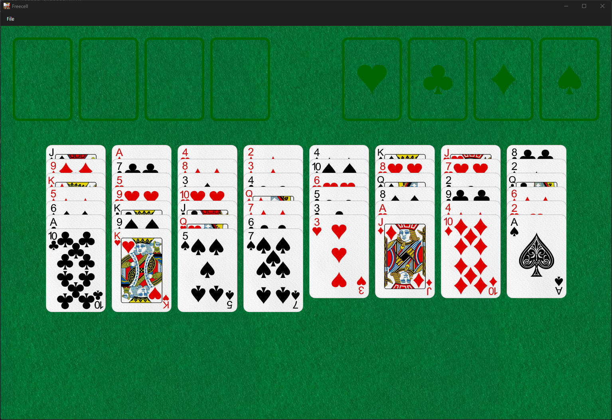

# Freecell

A free C++/Qt implementation of classic Freecell.

## Gameplay

## Origins & Acknowledgements

Original game files courtesy of:
https://github.com/juchi/Freecell

Playing card assets courtesy of:
https://github.com/hayeah/playing-cards-assets